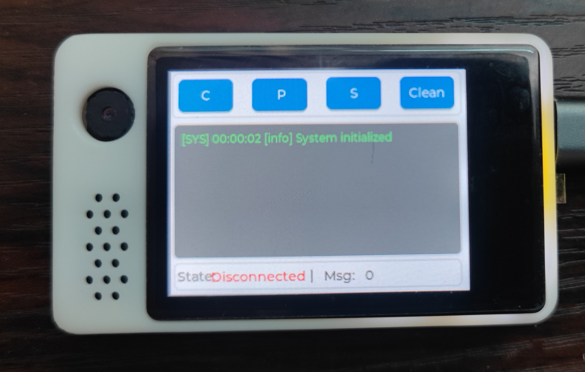

# ESP32 MQTT Tool with LCD Display

一个基于ESP32-S3的MQTT客户端工具，具有LCD触摸屏界面，支持MQTT消息的发布、订阅和显示功能。



## 项目特性

- 🖥️ **LCD触摸屏界面** - 基于LVGL的用户友好界面
- 📡 **MQTT客户端** - 支持消息发布、订阅和接收
- 🔧 **模块化设计** - 组件化架构，易于扩展和维护
- 📱 **实时消息显示** - 实时显示接收到的MQTT消息
- ⚡ **高性能** - 基于FreeRTOS的多任务处理
- 🛠️ **完整错误处理** - 包含连接失败、重连控制等错误处理机制

## 硬件要求

- **主控芯片**: ESP32-S3
- **显示屏**: 支持SPI接口的LCD显示屏 (320x240)
- **触摸控制器**: FT5x06系列触摸控制器
- **IO扩展**: PCA9557 I2C IO扩展芯片
- **接口**: I2C, SPI, PWM

### 引脚配置

| 功能 | 引脚 | 说明 |
|------|------|------|
| LCD SPI CLK | GPIO12 | LCD时钟信号 |
| LCD SPI MOSI | GPIO11 | LCD数据输出 |
| LCD SPI CS | GPIO10 | LCD片选 |
| LCD DC | GPIO13 | LCD数据/命令选择 |
| LCD RST | GPIO14 | LCD复位 |
| LCD Backlight | GPIO2 | LCD背光PWM控制 |
| I2C SDA | GPIO19 | I2C数据线 |
| I2C SCL | GPIO20 | I2C时钟线 |

## 软件架构

### 核心组件

1. **mqtt_tool** - MQTT客户端工具库
   - 连接管理
   - 消息发布/订阅
   - 错误处理

2. **mqtt_ui** - MQTT用户界面组件
   - 连接界面
   - 消息显示界面
   - 订阅/发布界面

3. **ui_interface** - 用户界面接口
   - 任务间通信
   - 消息队列管理

4. **mqtt_message_display** - 消息显示模块
   - 实时消息展示
   - 系统状态显示

### 任务架构

```
┌─────────────────┐    消息队列    ┌──────────────────┐
│   GUI Task      │ <─────────────→ │ Main Logic Task  │
│  (界面处理)      │                 │   (业务逻辑)      │
└─────────────────┘                 └──────────────────┘
         │                                   │
         ▼                                   ▼
┌─────────────────┐                 ┌──────────────────┐
│   LVGL UI       │                 │   MQTT Client    │
│  (界面渲染)      │                 │   (网络通信)      │
└─────────────────┘                 └──────────────────┘
```

## 开发环境

- **ESP-IDF**: v5.4.2 或更高版本
- **编译器**: GCC for Xtensa ESP32-S3
- **构建系统**: CMake
- **依赖管理**: ESP Component Manager

### 主要依赖

```yaml
dependencies:
  idf: ">=4.1.0"
  espressif/esp_lcd_touch_ft5x06: "==1.0.0"
  lvgl/lvgl: "^8.3.0"
  espressif/esp_lvgl_port: "^1.4.0"
```

## 快速开始

### 1. 环境准备

```bash
# 安装ESP-IDF
git clone -b v5.4.2 --recursive https://github.com/espressif/esp-idf.git
cd esp-idf
./install.sh esp32s3
source ./export.sh
```

### 2. 克隆项目

```bash
git clone https://github.com/HonestLiu/MQTT_Tool.git
cd MQTT_Tool
```

### 3. 配置项目

```bash
# 设置目标芯片
idf.py set-target esp32s3

# 配置项目（可选）
idf.py menuconfig
```

### 4. 编译和烧录

```bash
# 编译项目
idf.py build

# 烧录到设备
idf.py -p /dev/ttyUSB0 flash

# 查看日志
idf.py -p /dev/ttyUSB0 monitor
```

## 使用说明

### MQTT连接

1. **设置MQTT服务器**
   - 在界面中输入MQTT broker地址
   - 设置客户端ID（可选）
   - 输入用户名和密码（如需要）

2. **连接到服务器**
   - 点击"Connect"按钮
   - 连接成功后按钮变绿并显示"Connected"状态

### 消息订阅

1. 在订阅界面输入主题名称
2. 选择QoS等级 (0, 1, 2)
3. 点击"Subscribe"按钮

### 消息发布

1. 在发布界面输入主题名称
2. 输入消息内容
3. 选择QoS等级
4. 点击"Publish"按钮

### 消息查看

- 接收到的消息会实时显示在消息列表中
- 显示内容包括：主题、内容、QoS等级、时间戳
- 系统状态消息用不同颜色区分

## API 参考

### MQTT工具 API

```c
// 初始化MQTT工具
uint8_t mqtt_tool_init(mqtt_tool_handle_t* handle);

// 设置broker地址
uint8_t mqtt_tool_set_broker_uri(mqtt_tool_handle_t* handle, const char* uri);

// 设置客户端ID
uint8_t mqtt_tool_set_client_id(mqtt_tool_handle_t* handle, const char* client_id);

// 连接到MQTT服务器
uint8_t mqtt_tool_connect(mqtt_tool_handle_t* handle);

// 发布消息
uint8_t mqtt_tool_publish(mqtt_tool_handle_t* handle, const char* topic, 
                         const char* payload, int qos);

// 订阅主题
uint8_t mqtt_tool_subscribe(mqtt_tool_handle_t* handle, const char* topic, int qos);

// 断开连接
uint8_t mqtt_tool_disconnect(mqtt_tool_handle_t* handle);

// 清理资源
uint8_t mqtt_tool_deinit(mqtt_tool_handle_t* handle);
```

### 返回值

- `MQTT_TOOL_SUCCESS` (0) - 操作成功
- `MQTT_TOOL_ERROR_INVALID_PARAM` (1) - 无效参数
- `MQTT_TOOL_ERROR_NOT_INITIALIZED` (2) - 未初始化
- `MQTT_TOOL_ERROR_INIT` (3) - 初始化失败
- `MQTT_TOOL_ERROR_CONNECT` (4) - 连接失败

## 配置选项

### WiFi配置

在 `menuconfig` 中配置WiFi连接：

```
Example Configuration ->
    WiFi SSID
    WiFi Password
```

### MQTT默认配置

```c
#define MQTT_TOOL_DEFAULT_BROKER_URI "mqtt://mqtt.eclipseprojects.io"
#define MQTT_TOOL_DEFAULT_CLIENT_ID "esp32_mqtt_client"
#define MQTT_TOOL_DEFAULT_KEEPALIVE 60
```

## 故障排除

### 常见问题

1. **编译错误**
   ```
   解决方案：检查ESP-IDF版本是否正确，确保所有依赖已安装
   ```

2. **LCD显示异常**
   ```
   解决方案：检查SPI接线，确认LCD型号配置正确
   ```

3. **MQTT连接失败**
   ```
   解决方案：
   - 检查WiFi连接状态
   - 验证MQTT broker地址格式
   - 确认防火墙设置
   ```

4. **触摸无响应**
   ```
   解决方案：检查I2C接线，确认触摸控制器地址配置
   ```

### 调试技巧

1. **启用详细日志**
   ```c
   esp_log_level_set("*", ESP_LOG_VERBOSE);
   ```

2. **监控内存使用**
   ```c
   ESP_LOGI(TAG, "Free heap: %d", esp_get_free_heap_size());
   ```

3. **检查任务状态**
   ```bash
   # 在ESP-IDF监视器中
   esp32> tasks
   ```

## 贡献指南

1. Fork 本项目
2. 创建特性分支 (`git checkout -b feature/AmazingFeature`)
3. 提交更改 (`git commit -m 'Add some AmazingFeature'`)
4. 推送到分支 (`git push origin feature/AmazingFeature`)
5. 打开Pull Request

## 版本历史

- **v1.0.0** - 初始版本
  - 基本MQTT功能
  - LCD界面显示
  - 触摸交互

## 许可证

本项目采用 MIT 许可证 - 查看 [LICENSE](LICENSE) 文件了解详情

## 联系方式

- **作者**: HonestLiu
- **邮箱**: your.email@example.com
- **项目地址**: https://github.com/HonestLiu/MQTT_Tool

## 致谢

- [ESP-IDF](https://github.com/espressif/esp-idf) - Espressif物联网开发框架
- [LVGL](https://github.com/lvgl/lvgl) - 轻量级图形库
- [ESP-MQTT](https://github.com/espressif/esp-mqtt) - ESP32 MQTT客户端库

---

如果这个项目对你有帮助，请给一个 ⭐ Star！
